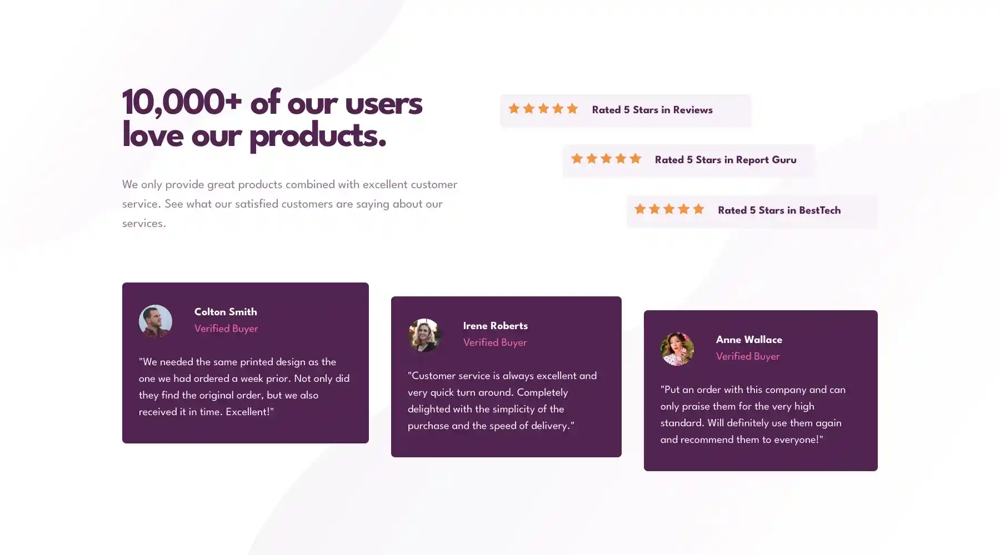

# Frontend Mentor - Social proof section solution

This is a solution to the [Social proof section challenge on Frontend Mentor](https://www.frontendmentor.io/challenges/social-proof-section-6e0qTv_bA). Frontend Mentor challenges help you improve your coding skills by building realistic projects. 

## Overview

### The challenge

Users should be able to:

- View the optimal layout for the section depending on their device's screen size

### Screenshot

### Links

- Solution URL: [github.com/migueweb/social-proof-section](https://github.com/migueweb/social-proof-section)
- Live Site URL: [migueweb.github.io/social-proof-section/](https://migueweb.github.io/social-proof-section/)

## My process

### Built with

- Semantic HTML5 markup
- tailwindcss
- CSS
- Mobile-first workflow

### Useful resources

- [background - CSS: Cascading Style Sheets | MDN](https://developer.mozilla.org/en-US/docs/Web/CSS/background) - This helped me for know how to use more than one image in the background 

## Author

- Github: [@migueweb](https://github.com/migueweb)